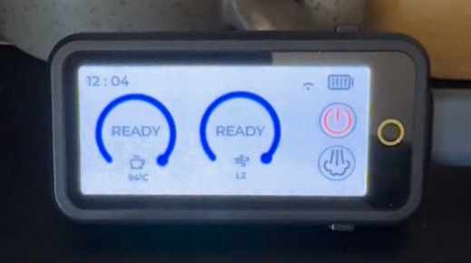

# La Marzocco Display

<p align="center">
  
</p>

A real-time display application for La Marzocco espresso machines, showing boiler temperatures, brewing status, and machine telemetry on an AMOLED screen.

## Features

- Real-time monitoring of La Marzocco espresso machine status (there is some delay caused by the architecture of LaMarzocco)
- Display boiler temperatures and brewing information
- WebSocket connection for "live" updates
- Web-based configuration interface
- Auto-reconnect functionality

## License

This project is **open source** and **free** to use, modify, and distribute.

## Supported Hardware

This project is designed for the [LilyGo T-Display S3 AMOLED](https://lilygo.cc/products/t-display-s3-amoled).

### Hardware Specifications:
- ESP32-S3 microcontroller
- 1.91" AMOLED display (240x536)
- WiFi connectivity
- USB-C interface

## Getting Started

### Prerequisites

- [PlatformIO](https://platformio.org/) installed (either standalone or as a VS Code extension)
- USB-C cable for connecting the display
- La Marzocco espresso machine with cloud connectivity

### Installation

1. **Clone the repository**
   ```bash
   git clone https://github.com/TobiKr/LaMarzocco-Display
   cd LaMarzocco-Display
   ```

2. **Open the project**
   - If using VS Code: Open the project folder in VS Code with PlatformIO extension installed
   - If using PlatformIO CLI: Navigate to the project directory

3. **Build the project**
   ```bash
   pio run
   ```
   Or click the "Build" button in the PlatformIO toolbar in VS Code.

4. **Connect your T-Display S3 AMOLED**
   - Connect the device to your computer via USB-C cable
   - The device should be recognized automatically

5. **Upload to the device**
   ```bash
   pio run --target upload
   ```
   Or click the "Upload" button in the PlatformIO toolbar in VS Code.

6. **Upload Filesystem Image**
   ```bash
   pio run --target uploadfs
   ```
   Or click the "Upload Filesystem Image" button in the PlatformIO toolbar in VS Code.
   
7. **Configure WiFi and La Marzocco credentials**
   - After first boot, the device will create a WiFi access point
   - Connect to the AP and configure your WiFi credentials and La Marzocco account details via the web interface

### Monitoring Serial Output

To view debug output and monitor the device:
```bash
pio device monitor
```
Or click the "Serial Monitor" button in the PlatformIO toolbar.

## Configuration

The device provides a web interface for configuration. After connecting to your WiFi network, you can access the configuration page to set up:
- WiFi credentials
- La Marzocco account information
- Display preferences

## Contributing

**Developers wanted!** We're looking for contributors to help improve this project. Whether you're interested in:
- Adding new features
- Improving the UI/UX
- Bug fixes and optimizations
- Documentation improvements
- Supporting additional hardware

Your contributions are welcome! Feel free to:
- Open issues for bugs or feature requests
- Submit pull requests
- Share your ideas and improvements

## Troubleshooting

### Upload Issues
- Make sure the USB-C cable supports data transfer (not just charging)
- Try pressing the BOOT button on the device while uploading
- Check that no other program is using the serial port

### WiFi Connection Issues
- Verify your WiFi credentials are correct
- Ensure the device is within range of your WiFi network
- Check that your network supports 2.4GHz (ESP32 doesn't support 5GHz)

## Support

For questions, issues, or suggestions, please open an issue on the GitHub repository.
